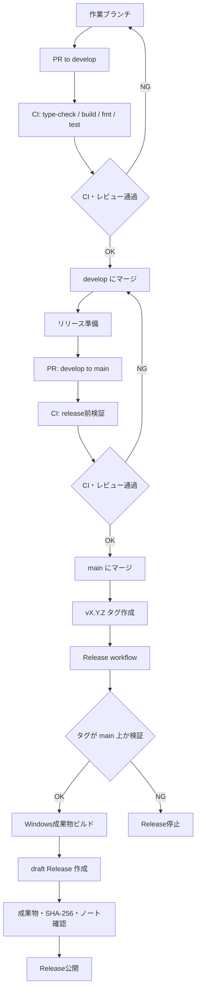

# CI/CD 計画

このリポジトリは、ソースコードを公開して誰でも閲覧・クローンできる一方で、現時点では、Pull Request による参加はメンテナーが許可したユーザーに限定する方針です。

## 基本方針

- `develop` を通常開発の集約ブランチ、`main` をリリース用ブランチとする
- 作業ブランチからの PR は原則 `develop` に向ける
- リリース時は `develop` から `main` へ PR を作成し、CI 通過とレビュー後にマージする
- PR は許可済みコントリビューター、Collaborator、Organization member からのみ受け付ける
- 外部からの提案は Issue で受け付け、必要に応じてメンテナーが作業ブランチへ反映する
- CI は `develop` / `main` 向け PR と両ブランチへの push で実行し、リリースビルドは `main` 上のタグまたは手動実行に限定する
- Release は draft として作成し、成果物・チェックサム・リリースノートを確認してから公開する

## 現在のワークフロー

| ワークフロー | ファイル                        | トリガー                                              | 目的                                      |
| ------------ | ------------------------------- | ----------------------------------------------------- | ----------------------------------------- |
| CI           | `.github/workflows/ci.yml`      | `develop` / `main` 向け PR、両ブランチへの push、手動 | PR と通常開発の検証                       |
| Release      | `.github/workflows/release.yml` | `main` 上の `v*` タグ / 手動                          | Windows 向け成果物と draft Release の作成 |

## CI/CD フロー



## PR CI

PR CI では以下を確認する。

- 3 系統の Vue フロントエンドの `npm ci`
- 3 系統の Vue フロントエンドの `type-check`
- 3 系統の Vue フロントエンドの `build-only`
- Tauri/Rust に埋め込む `dist/` 成果物の生成
- `cargo fmt --check`
- `cargo test --locked`

`cargo clippy` は既存警告の整理後に必須化する。導入時は `continue-on-error` ではなく、警告を解消してから必須チェックへ追加する。

## PR 前のローカル確認

コントリビューターは PR を作成する前に、可能な範囲で以下をローカル実行する。環境差分などで実行できない項目がある場合は、PR 本文に未実施理由を書く。

### フロントエンド依存関係の再現性確認

```powershell
npm ci --prefix src_frontend/frontend
npm ci --prefix src_frontend/frontend-mobile
npm ci --prefix src_frontend/frontend-admin
```

3 系統のフロントエンドで、`package-lock.json` に固定された依存関係をクリーンにインストールできることを確認する。これにより、ローカルの `node_modules` に残った依存や暗黙の更新に頼っていないこと、CI と同じ依存解決で検証できることを確認する。

### フロントエンド型チェック

```powershell
npm run type-check --prefix src_frontend/frontend
npm run type-check --prefix src_frontend/frontend-mobile
npm run type-check --prefix src_frontend/frontend-admin
```

Vue / TypeScript の型検査を行い、コンポーネント、store、router、API 呼び出し周辺で型の不整合がないことを確認する。通常画面、モバイル画面、管理画面は別プロジェクトとして存在するため、変更箇所に関係しそうな一部だけでなく 3 系統すべてを確認する。

### 埋め込み用フロントエンド成果物の生成確認

```powershell
./src_frontend/scripts/frontends-builder.ps1 -SkipCargoBuild
```

3 系統のフロントエンドをビルドし、Tauri / Rust 側に埋め込む `dist/` 成果物を生成できることを確認する。`-SkipCargoBuild` を付けることで、重い Rust release build は省略しつつ、HTML のパス調整、`index-mobile.html` / `index-admin.html` の生成、静的アセットの集約、`dist/templates` の配置までを検証する。

### Rust フォーマット確認

```powershell
cargo fmt --check
```

Rust コードが `rustfmt.toml` に沿って整形済みであることを確認する。PR では機能変更と無関係な整形差分を避けるため、フォーマット差分がある場合は事前に `cargo fmt` を実行してから差分を確認する。

### Rust テスト確認

```powershell
cargo test --locked
```

Rust 側のユニットテストを、`Cargo.lock` に固定された依存関係で実行する。これにより、バックエンド処理、ルーティング補助、モデル変換など、既存テストで守られている挙動が壊れていないことを確認する。SQLx のクエリ検証は環境変数や SQLite DB の状態に依存するため、ローカルで失敗する場合は `.env` と SQLite マイグレーション状態も確認する。

> 現状、テストが充実していないため、今後の課題

UI 変更を含む場合は、対象画面を起動して表示崩れや主要操作を確認し、PR 本文に確認内容またはスクリーンショットを添付する。仕様変更、リリースノートに値する変更、セキュリティや個人情報の扱いに関わる変更では、関連ドキュメントの更新漏れがないか確認する。

## GitHub 側で設定すること

公開リポジトリでは、未許可ユーザーによる fork や PR 作成そのものは完全には止められない。そのため、GitHub 側で「Actions 実行」「マージ」「保護ブランチへの push」「リリースタグの作成・更新・削除」を制限し、未許可ユーザーからの提案は Issue またはクローズ対象の PR として扱う。

1. Settings > Actions > General
   - Actions permissions は、必要な GitHub Actions と reusable workflows のみを許可する
   - Workflow permissions は `Read repository contents and packages permissions` を基本にする
   - `Allow GitHub Actions to create and approve pull requests` は無効にする
   - 公開リポジトリの場合、`Approval for running fork pull request workflows from contributors` は `Require approval for all external contributors` を選択する
2. Settings > Rules > Rulesets
   - `develop` と `main` に add branch ruleset を追加する
   - `develop` は作業ブランチからの PR 集約先として保護する
   - `main` はリリース用ブランチとして保護し、原則 `develop` からの PR のみをマージする
   - `develop` 用 branch ruleset は次のように設定する

| 項目                                                             | 設定                                                                                                                                                                                                                                                                                                                   |
| ---------------------------------------------------------------- | ---------------------------------------------------------------------------------------------------------------------------------------------------------------------------------------------------------------------------------------------------------------------------------------------------------------------- |
| Ruleset Name                                                     | `protect-develop`                                                                                                                                                                                                                                                                                                      |
| Enforcement status                                               | `Active`                                                                                                                                                                                                                                                                                                               |
| Target branches                                                  | `Include by pattern` で `develop` を指定                                                                                                                                                                                                                                                                               |
| Bypass list                                                      | 原則空。緊急時の直接更新を許す場合のみ、管理者またはメンテナー Team を必要最小限で追加                                                                                                                                                                                                                                 |
| Restrict deletions                                               | 有効                                                                                                                                                                                                                                                                                                                   |
| Block force pushes                                               | 有効                                                                                                                                                                                                                                                                                                                   |
| Require a pull request before merging                            | 有効                                                                                                                                                                                                                                                                                                                   |
| Required approvals                                               | `1` 以上                                                                                                                                                                                                                                                                                                               |
| Dismiss stale pull request approvals when new commits are pushed | 有効                                                                                                                                                                                                                                                                                                                   |
| Require conversation resolution before merging                   | 有効                                                                                                                                                                                                                                                                                                                   |
| Require status checks to pass                                    | 有効                                                                                                                                                                                                                                                                                                                   |
| Required status checks                                           | `CI` workflow を一度実行した後に表示されるチェック名を指定する。現状は `Frontend type-check and build (src_frontend/frontend)`, `Frontend type-check and build (src_frontend/frontend-mobile)`, `Frontend type-check and build (src_frontend/frontend-admin)`, `Rust format, test, and integration build` を必須にする |
| Require branches to be up to date before merging                 | 有効                                                                                                                                                                                                                                                                                                                   |
| Restrict updates                                                 | 有効。bypass 権限を持たないユーザーの `develop` への直接 push を防ぎ、PR 経由の集約を強制する                                                                                                                                                                                                                          |
| Require linear history                                           | 必要に応じて有効。merge commit を残す運用にする場合は無効                                                                                                                                                                                                                                                              |
| Require signed commits                                           | 署名運用を始める場合のみ有効                                                                                                                                                                                                                                                                                           |
| Require deployments to succeed before merging                    | 現時点では未使用                                                                                                                                                                                                                                                                                                       |

- `main` 用 branch ruleset は次のように設定する。`main` はリリース用ブランチであり、通常の作業ブランチから直接マージしない。原則として `develop` から `main` へのリリース PR のみを通す。

| 項目                                                             | 設定                                                                                               |
| ---------------------------------------------------------------- | -------------------------------------------------------------------------------------------------- |
| Ruleset Name                                                     | `protect-main`                                                                                     |
| Enforcement status                                               | `Active`                                                                                           |
| Target branches                                                  | `Include by pattern` で `main` を指定                                                              |
| Bypass list                                                      | 原則空。どうしても必要な場合のみ、リリース権限を持つメンテナーまたは Team に限定                   |
| Restrict deletions                                               | 有効                                                                                               |
| Block force pushes                                               | 有効                                                                                               |
| Require a pull request before merging                            | 有効                                                                                               |
| Required approvals                                               | `1` 以上。可能であれば `develop` より多くする                                                      |
| Dismiss stale pull request approvals when new commits are pushed | 有効                                                                                               |
| Require conversation resolution before merging                   | 有効                                                                                               |
| Require status checks to pass                                    | 有効                                                                                               |
| Required status checks                                           | `develop` と同じ CI チェックを必須にする                                                           |
| Require branches to be up to date before merging                 | 有効                                                                                               |
| Restrict updates                                                 | 有効。bypass 権限を持たないユーザーの `main` への直接 push を防ぎ、PR 経由のリリース反映を強制する |
| Require linear history                                           | リリース履歴を直線的に保ちたい場合は有効。merge commit を残す場合は無効                            |
| Require signed commits                                           | 署名運用を始める場合のみ有効                                                                       |
| Require deployments to succeed before merging                    | 現時点では未使用                                                                                   |

- `main` ruleset だけでは「PR の base が `develop` であること」までは厳密に強制できない。運用上は、`main` 向け PR はメンテナーが `develop` から作成し、レビュー時に base/head ブランチを確認する。
- `v*` 用 tag ruleset は次のように設定する。リリースタグは GitHub Release workflow の起点になるため、作成・更新・削除をリリース権限者に限定する。

| 項目               | 設定                                                               |
| ------------------ | ------------------------------------------------------------------ |
| Ruleset Name       | `protect-release-tags`                                             |
| Enforcement status | `Active`                                                           |
| Target tags        | `Include by pattern` で `v*` を指定                                |
| Bypass list        | リリース権限を持つメンテナーまたは Team のみに限定                 |
| Restrict creations | 有効。許可されたユーザー以外が `v*` タグを作成できないようにする   |
| Restrict updates   | 有効。作成済みの `v*` タグを別コミットへ付け替えられないようにする |
| Restrict deletions | 有効。公開済みまたは準備中のリリースタグを削除できないようにする   |

- リリースタグは `main` にマージ済みのリリース対象コミットに対してのみ作成する。
- Release workflow でもタグが `main` 上のコミットを指しているか検証する。tag ruleset は「誰がタグを操作できるか」を制限し、workflow 側の検証は「タグが正しいブランチ由来か」を確認する役割を持つ。

3. Settings > Collaborators and teams
   - PR を受け付けるユーザーだけを Collaborator または Team に追加する
4. Settings > Moderation options または Interaction limits
   - 必要に応じて Interaction limits を使い、未許可ユーザーからの直接参加を抑制する

## リリース運用

1. `release_notes.md` と `CHANGELOG.md` を更新する
2. 作業ブランチから `develop` への PR を通し、変更を `develop` に集約する
3. リリース時に `develop` から `main` への PR を作成し、CI とレビューを通してマージする
4. `main` 上のリリース対象コミットに `vX.Y.Z` タグを作成して push する、または既存タグを指定して Release workflow を手動実行する
5. draft Release の成果物、SHA-256、リリースノートを確認する
6. 問題なければ Release を公開する

## 今後の整備候補

- `cargo clippy --locked --all-targets` の必須化
- `cargo sqlx prepare --check` による SQLx オフラインメタデータの検証
- Dependabot による GitHub Actions / npm / Cargo 依存更新 PR
- Windows インストーラの簡易起動確認
- 署名付きリリース成果物の作成
