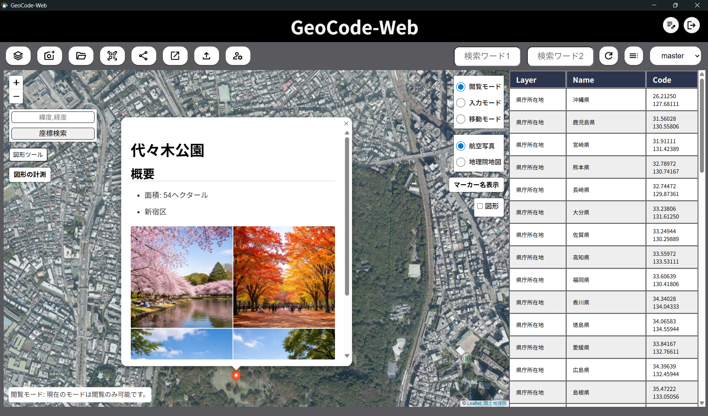

# GeoCode-Web-SingleBin

地図上にマーカー（テキスト、写真、動画、PDF）や図形などの情報を配置し、管理できる**マッピングアプリケーション**です。「**場所に紐付いた情報管理**」を実現します。


- 画像・PDF・動画の添付
- ポリゴン/ライン/矩形の図形描画
- レイヤによる情報整理
- 期限付き共有 URL の発行

Rust/Axum 製 API サーバーと Vue 3 製フロントエンドを Tauri 2 でラップし、SQLite データベースとともに Windows 向けアプリケーションとして配布します。

> このプロジェクトは PostgreSQL をデータベースに使用したフル構成を Windows 環境でオフライン動作させることを目的に再構築したものです。

**現時点では Windows のみサポートしています。** 配布形式は Windows NSIS インストーラ（`.exe`）、MSI インストーラ（`.msi`）、および cargo が生成する単体実行ファイル（`.exe`）です。

## ドキュメント

- ユーザーガイド: [USER-GUIDE.md](./userguide/USER-GUIDE.md)
- 仕様書: [SPECIFICATION.md](SPECIFICATION.md)
- 変更履歴: [CHANGELOG.md](CHANGELOG.md), [release_notes.md](release_notes.md)
- コントリビューションガイド: [CONTRIBUTING.md](CONTRIBUTING.md)
- セキュリティポリシー: [SECURITY_POLICY.md](SECURITY_POLICY.md)
- プライバシーポリシー: [PRIVACY_POLICY.md](PRIVACY_POLICY.md)
- 行動規範: [CODE_OF_CONDUCT.md](CODE_OF_CONDUCT.md)

## 機能

### 地図・マーカー

- 地図上へのマーカー追加・移動・編集・削除
- マーカー詳細を **Markdown** で記述し、簡易 Wiki として利用可能（Ace Editor による編集）
- 指定マーカーへのフォーカス・ズームイン
- 国土地理院の通常地図・航空写真を初期タイルとして利用可能
- マーカー検索
  - マスターレイヤでは全件横断検索
  - 個別レイヤではそのレイヤ内のみ検索
- レイヤに紐付いた図形描画
  - ポリゴン / ポリライン / 矩形を作成可能
  - 図形名の表示・編集と所属レイヤ変更に対応
  - 図形の削除と削除直後の取り消しに対応
  - マスターレイヤでは全レイヤの図形を表示し、個別レイヤでは当該レイヤの図形のみ表示


### レイヤ管理

- ユーザーごとに `master` レイヤを自動作成（名称変更・削除不可）
- 任意レイヤの追加・名称変更・削除
- レイヤ単位または全件の JSON エクスポート / インポート
  - マーカーと図形をまとめた v2 形式で出力
  - 従来のマーカー配列のみの JSON もインポート可能
  - Tauri アプリ上では Downloads（取得できない場合は Documents）へ直接保存

### ファイル管理

アップロード対応形式: **PNG / JPG / JPEG / GIF / WebP / PDF / MP4**

- アップロード・一覧表示・プレビュー・削除
- アップロード上限は 1 ファイル **100MB**
- 画像は**再エンコードして保存**（EXIF 等のメタデータを除去）
- 画像サムネイルを生成し、Markdown 表示時は `?thumb=true` で軽量表示
- MP4 はアップロード時に可能な場合 poster 画像を生成し、動画タグの `poster` として利用
- Markdown 内の動画は `preload="none"` で描画し、ポップアップ内の画像・動画は details 展開時に遅延読み込み
- **Markdown 埋め込み文字列を自動生成**
  - 画像: ``
  - PDF: `[name](url)`
  - 動画: `?[name](url)`
- ファイルは `~/.geocode-web-single/images/<先頭5文字>/<uuid>` に保存
- サムネイル / poster は `~/.geocode-web-single/images/<先頭5文字>/thumb/` に保存



### 公開・共有

**期限付き共有 URL**

- 共有対象レイヤを選択して、期限付きの閲覧用 URL を発行できる
- 共有ページは発行時点のレイヤ・マーカー情報を保持するスナップショット方式
- 図形は共有作成時に「図形も共有する」を選択した場合のみスナップショットに含める
- 任意の共有パスワードを設定できる（未入力ならパスワード保護なし）
- 既存リンクの内容更新と、共有停止（無効化）に対応
- 現在有効な共有リンクの URL、有効期限、パスワード保護有無を確認できる
- デスクトップ / モバイルのどちらでも専用レイアウトで閲覧できる
- フロントエンドでは有効期限を 10 分以上で指定する

**プライバシーモード**

- ユーザー単位で画像の外部公開を制御する
- プライバシーモード ON の場合、自分以外からの画像アクセスを遮断する

### 認証・セキュリティ

**認証方式**

- アクセストークン + リフレッシュトークンを JWT で発行
- 両トークンは **HttpOnly Cookie** で保持（`SameSite=Strict`）
- リフレッシュトークンは専用パス `/account/refresh` に限定

**TOTP 二段階認証**

1. QR コードをアプリで読み取る
2. 6 桁のコードを入力して検証する
3. 検証成功でシークレットが本番昇格される
4. 以降のログインはパスワード認証後に TOTP コード入力が必要（一次認証の有効期限は 3 分）

**ログイン失敗制御**

- 失敗回数が閾値を超えると一定時間の再試行待ち状態になる
- 上限回数に達するとアカウントがロックされる（管理者が解除可能）
- ログイン成功時に失敗カウントをリセットする

- **アカウント管理**
  - ユーザーの作成やパスワードのリセットの処理は管理者が行う仕様。
    - 環境変数 `VITE_ALLOW_USER_CREATE_ACCOUNT` を true とすることで、ユーザーは任意にアカウントを作成可能
    - 環境変数 `ALLOW_USER_UPDATE_PASSWORD` を true とすることで、ユーザーは自身のパスワードを変更可能
  - スーパーユーザーがアカウント（初回起動時に作成）で`/admin`にアクセス。

### 管理者機能

- ユーザー一覧取得
- 一般ユーザー作成（または設定による自己サインアップ）
- パスワード再設定
- アカウントロック解除

### 権限モデル

| ロール       | 内容                                                  |
| ------------ | ----------------------------------------------------- |
| 管理者       | 初回セットアップで作成。管理系 API すべてにアクセス可 |
| 一般ユーザー | 管理者が作成、またはサインアップ（設定で制御）        |

すべてのレイヤ・マーカー・図形・画像は所有ユーザー単位で分離され、本人のみ更新・削除できる。

### モバイル対応

User-Agent に `Mobile` が含まれるアクセスにはモバイル向け UI (`index-mobile.html`) を返す。ツール群はフローティングボタンと全画面モーダル中心の操作に最適化されており、一時共有 URL のプレビューも同様にモバイル用レイアウトを使い分ける。


## 技術スタック

```txt
バックエンド  : Rust 2024 + Axum + SQLx + SQLite
フロントエンド: Vue 3 + Vue Router + Pinia + Vite
デスクトップ  : Tauri 2
テンプレート  : Tera
認証          : JWT + HttpOnly Cookie + TOTP
アセット埋込  : rust-embed
エディタ      : Ace Editor
表示拡張      : marked
配布          : GitHub Actions + NSIS / MSI Installer
```

## セットアップ

インストーラで導入後、アプリを起動する。初回起動時はセットアップ画面が表示され、管理者アカウントや各種設定を入力する。


初回セットアップで設定できる項目:

| 項目                               | 内容                                     |
| ---------------------------------- | ---------------------------------------- |
| アプリタイトル                     | ウィンドウタイトルや UI に表示される名称 |
| 管理者ユーザー名 / パスワード      | 初期管理者アカウント                     |
| アカウントロック回数               | この回数の失敗でアカウントをロックする   |
| 待機制限開始回数                   | この回数以上の失敗で再試行待ち状態にする |
| 待機時間（分）                     | 再試行待ち状態の継続時間                 |
| アクセストークン有効期限（分）     |                                          |
| リフレッシュトークン有効期限（分） |                                          |

設定完了後、以下が自動生成されてそのまま Wiki が使い始められる。

```txt
~/.geocode-web-single/
  ├── geocode-web-single.env.json   # 設定ファイル
  ├── geocode-web.sqlite            # SQLite DB
  └── images/                       # アップロードファイル保存先
```

## 起動方法

### 通常起動（Tauri デスクトップアプリ）

インストーラで導入後、アプリを起動する。

### サーバー単体モード

GUI を使わずコマンドラインで Axum サーバーを起動する。事前に Tauri GUI でセットアップを完了しておく必要がある。

```bash
# ホストのみ指定（ポートは 3000 を使用）
geocode_web_single -s 0.0.0.0

# ホスト:ポート形式でポートを指定
geocode_web_single -s 0.0.0.0:9090
```

Ctrl+C でグレースフルシャットダウンする。

> **HTTP 環境で運用する場合**
> デフォルトでは `SECURE_COOKIE=true` のため、HTTPS なしの環境では Cookie が機能しない。
> `~/.geocode-web-single/geocode-web-single.env.json` の `"secure_cookie"` を `"false"` に変更すること。

## 開発環境のセットアップ

### 前提ツール

- Rust stable
- Node.js 20.x
- npm
- PowerShell 7 以上
- `sqlx-cli`
- `tauri-cli`
- Windows では WebView2 が利用可能であること

まず `.env.example` を `.env` としてコピーする。

```powershell
Copy-Item .env.example .env
```

### 1. 環境変数の設定（`.env`）

```
DATABASE_URL=sqlite:/path/to/GeoCode-Web-SingleBin/geocode-web.sqlite
CREATEDATABASE_PATH=/path/to/GeoCode-Web-SingleBin/geocode-web.sqlite

# 開発時（フロントエンド開発サーバー使用時）
# VITE_IP_ADDRESS=http://localhost:3000
# VITE_ASSET_PATH=/

# フロントエンドビルド時
VITE_IP_ADDRESS=
VITE_ASSET_PATH=/assets/
```

### 2. SQLite データベースの作成

```bash
sqlx database create
sqlx migrate run
```

### 3. フロントエンドのビルド

```bash
cd src_frontend/scripts
./frontends-builder.ps1
```

### 4. sqlx オフラインクエリの準備

```bash
cargo sqlx prepare
```

### 5. Tauri アプリのビルド

```bash
cargo tauri build
```

Windows では Tauri の NSIS インストーラ（`.exe`）と MSI インストーラ（`.msi`）に加えて、`target/release/` 直下に cargo が生成する単体実行ファイル（`.exe`）も出力される。

## GitHub Release ワークフロー

GitHub Actions では [.github/workflows/release.yml](.github/workflows/release.yml) により、Windows 向けリリースビルドを行う。

- トリガーは `v*` タグ push、または `workflow_dispatch`
- 実行環境は `windows-latest`
- ルートに CI 用の `.env` を生成し、`sqlx-cli` で SQLite スキーマを作成する
- `src_frontend/scripts/frontends-builder.ps1` で 3 系統のフロントエンド成果物を `dist/` に集約する
- `cargo tauri build` で Windows NSIS インストーラ、MSI インストーラ、単体実行ファイルを生成する
- 生成したインストーラ（`.exe` / `.msi`）と cargo 生成の単体 `.exe` を収集し、SHA-256 チェックサム付きで GitHub Release の draft に添付する

## OSS 公開とサポート方針

GeoCode-Web-Single は、ソースコードを OSS として公開しつつ、一般利用者には Windows 向けリリース成果物をフリーソフトのように利用できる形で配布します。

- 通常の不具合報告、機能要望、改善提案は GitHub Issue で受け付けます
- 大きな変更に入る前は、Issue で方針を相談してください
- Pull Request は歓迎します。詳しくは [CONTRIBUTING.md](CONTRIBUTING.md) を参照してください
- セキュリティ上の問題は公開 Issue に書かず、[SECURITY.md](SECURITY.md) の案内に従ってください
- 現時点の主なサポート対象は Windows 版とデフォルトブランチ上の最新版です

### 公開前・配布前の確認

リリース前には、少なくとも以下を確認してください。

- `.env`、SQLite データベース、ローカル設定ファイル、個人情報を含むファイルがコミットや配布物に含まれていないこと
- スクリーンショット、サンプルデータ、ユーザーガイド画像に個人情報や公開できない地物情報が含まれていないこと
- 同梱している JavaScript、CSS、画像、アイコン、フォントなどの第三者コンポーネントが [THIRD_PARTY_NOTICES.md](THIRD_PARTY_NOTICES.md) に記載されていること
- リリース成果物に含めるファイルが、それぞれのライセンス条件を満たしていること

### 免責事項

このソフトウェアは現状有姿で提供されます。作者およびコントリビューターは、利用、運用、データ損失、設定不備、セキュリティ設定、外部公開設定、その他このソフトウェアに関連して発生した損害について、法令で認められる範囲で責任を負いません。

利用者は、自身の環境、ネットワーク、認証設定、バックアップ、公開範囲を確認したうえで利用してください。サポート、修正、過去バージョンへのバックポート、特定環境での動作は保証しません。

## Docker によるバイナリビルド（サーバー単体モード用）

Linux バイナリをクロスビルドする場合に使用する。

```bash
docker build -t geocode-web-single .
docker run --name geocode-web-app geocode-web-single
docker cp geocode-web-app:/web/target/release/geocode_web_single .
```

## Nginx プロキシサーバーを Docker で用意

```bash
docker run --name proxy-nginx --network=host -p 80:80 \
  -v $(pwd)/utils/nginx/nginx.conf.template:/etc/nginx/nginx.conf:ro \
  -d nginx
```

## License

このリポジトリのアプリケーション本体は [MIT License](LICENSE) で公開しています。

同梱または依存している第三者コンポーネントは、それぞれのライセンス条件に従います。主要な第三者コンポーネントについては [THIRD_PARTY_NOTICES.md](THIRD_PARTY_NOTICES.md) を参照してください。
