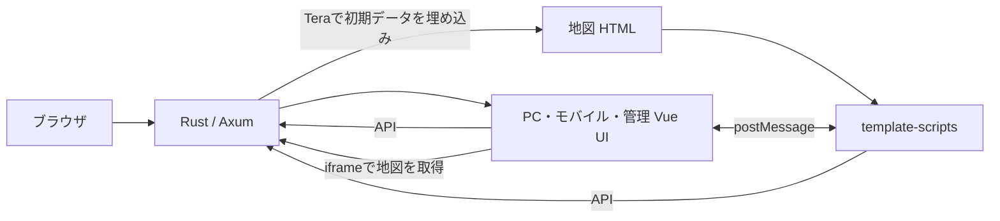
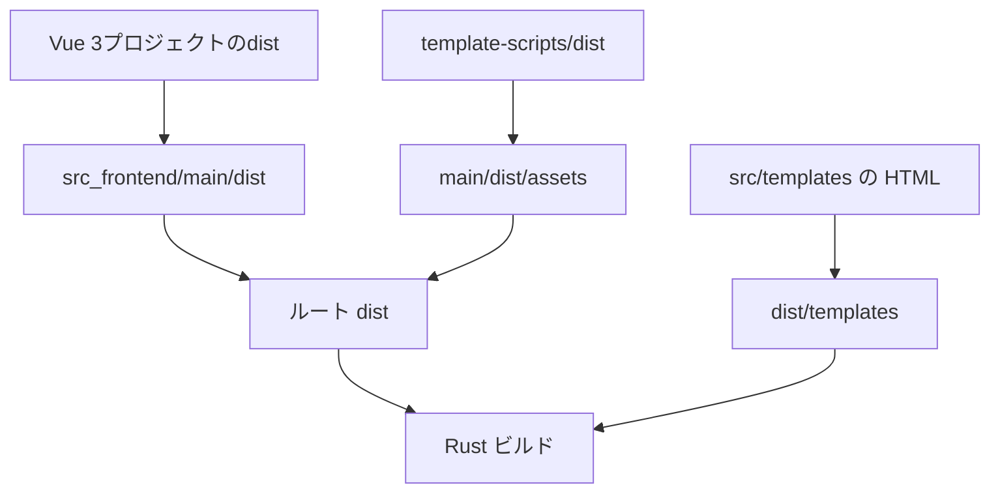

# フロントエンド全体構成

## 1. 対象と関連文書

この文書はフロントエンドの配置、画面間の責務、開発・配布の構成を説明する。アプリケーション全体の機能、権限、データモデル、APIの詳細は [ルート仕様書](../SPECIFICATION.md) を参照する。

| 領域 | 詳細仕様 | 役割 |
| --- | --- | --- |
| PC UI | [frontend](frontend/SPECIFICATION.md) | 一覧、設定、モーダルと編集地図の連携 |
| 管理 UI | [frontend-admin](frontend-admin/SPECIFICATION.md) | ユーザー、位置共有マップ、重ね合わせタイルの管理 |
| モバイル UI | [frontend-mobile](frontend-mobile/SPECIFICATION.md) | モバイル用の画面と編集地図の連携 |
| テンプレート用スクリプト | [template-scripts](template-scripts/SPECIFICATION.md) | 地図の表示・編集、公開フォーム、画像プレビュー |
| サーバー生成 HTML | [Tera templates](../src/templates/SPECIFICATION.md) | 初期データとDOM、資材の読み込み |

記述はソース・設定から確認した現行仕様である。実画面やOSの印刷ダイアログの動作保証を表すものではない。

## 2. ディレクトリ構成

```text
src_frontend/
├── frontend/          PC用Vueアプリ（独立したpackage.json）
├── frontend-admin/    管理用Vueアプリ（独立したpackage.json）
├── frontend-mobile/   モバイル用Vueアプリ（独立したpackage.json）
├── template-scripts/  Tera用TypeScript（独立したpackage.json）
├── scripts/           統合ビルド・配布用スクリプト
└── main/              統合時の作業場所。dist/は生成物
```

各プロジェクトが個別に依存関係とpackage-lock.jsonを持つ。共通のnpm workspaceによる一括管理ではない。PCとモバイルのVueコンポーネント、ストア、型定義は各プロジェクトに存在するため、片方の修正が自動で他方に反映されるとは限らない。

## 3. 実行時の関係



### 3.1 HTMLの選択と画面遷移

- `/` は `/index` にリダイレクトする。
- `/index` はUser-Agentに大文字小文字を区別した `Mobile` が含まれる場合、`index-mobile.html`、それ以外は `index.html` を返す。
- `/map` と一時共有地図もUser-AgentからPC／モバイルのテンプレートを選ぶ。Vue側の画面幅による切り替えではない。
- `/admin` はアクセストークンを必要とする。管理者には `index-admin.html`、管理者以外にはPCの `index.html` を返す。
- Vueアプリは `createWebHistory` を使用する。Vue内の `/mapview` や `/users/list` などと、RustがHTMLを返すURLは別に定義されている。
- Rustの未定義URLへのアクセスは `/index` にリダイレクトする。Vue内部URLを直接開く／再読み込みした場合に、その画面をそのまま再現する共通SPAフォールバックは実装されていない。

根拠: [src/lib.rs](../src/lib.rs)、[src/router.rs](../src/router.rs)、[管理者ハンドラー](../src/handler/admin.rs)。

### 3.2 UIと地図の分担

Vueは一覧、入力モーダル、アップロード、共有設定などを担当する。iframeの地図はLeafletを使用し、描画、クリック・タッチ操作、図形編集、ポップアップ、検索、計測を担当する。API通信はVueのAxiosと地図のfetchの両方に存在する。

Teraからの地図初期データとiframe間メッセージは [スクリプト仕様](template-scripts/SPECIFICATION.md) を参照する。管理UIが作成する公開URLはVueアプリを経由せずTera画面として閲覧できる。

## 4. 開発環境

VueアプリはVue 3、TypeScript、Vite、Vue Router、Pinia、Axiosを使用する。テストはVitestとjsdomを使用する。正確な依存バージョンは各package.jsonとlockfileを正とする。

各VueプロジェクトのVite設定は `base: "./"`、`envDir: "../../"`、`@` を `src/` に割り当てる。リポジトリルートの環境変数を参照する。

| 変数 | 用途 | 開発例 | 配布例 |
| --- | --- | --- | --- |
| `VITE_IP_ADDRESS` | APIと地図のバックエンドURL | `http://localhost:3000` | 空文字 |
| `VITE_ASSET_PATH` | UIアイコンなどのパス | `/` | `/assets/` |

Vite変数はビルド時に組み込まれる。API接続に必要なバックエンド・DBの準備は [README](../README.md) を参照する。開発サーバーだけではTera地図やAPIは動作しない。

Vueプロジェクトのディレクトリで実行する基本コマンド:

```sh
npm ci
npm run dev
npm run type-check
npm run test:run
npm run build
```

`build` は型チェックと `build-only` を並行実行する。`preview` は個別Vite成果物の確認用であり、統合配布の代替ではない。3つの開発サーバーを同時起動するとポートが変わる場合がある。バックエンドCORS、`/app-init` の許可オリジン、地図スクリプトの受信元判定を合わせて確認する。

`template-scripts` のコマンドは [個別仕様](template-scripts/SPECIFICATION.md) を参照する。開発・previewスクリプトは定義されていない。

## 5. ビルド・配布

### 5.1 成果物の流れ



統合スクリプトは既存の各distと統合先を削除して作り直す。PC、モバイル、管理、template-scriptsをビルドし、HTML内の一部資材パスを `/assets/` に置換する。モバイルHTMLは `index-mobile.html`、管理HTMLは `index-admin.html` に改名する。

Vue成果物を `main/dist/` に統合し、公開資材を `assets/` に集め、template-scriptsの成果物を同じassetsにコピーする。最後にルートdistへ配置し、Teraの `*.html` のみを `dist/templates/` にコピーする。仕様書はテンプレート配布の対象外である。

| 項目 | PowerShell版 | Shell版 |
| --- | --- | --- |
| ファイル | [frontends-builder.ps1](scripts/frontends-builder.ps1) | [frontends-builder.sh](scripts/frontends-builder.sh) |
| node_modulesがない場合 | `npm install` | `npm ci` |
| `-d` | node_modulesも削除して依存を再導入 | 同左 |
| Rustのビルド | 最後に `cargo build --release` を実行 | 実行しない。別途必要 |
| 資材移動 | js・mjs・css・json・svg等を移動 | js・css・svgと指定manifest等を移動 |

リポジトリルートから実行する:

```powershell
./src_frontend/scripts/frontends-builder.ps1
```

```sh
bash ./src_frontend/scripts/frontends-builder.sh
cargo build --release
```

スクリプト全体で各外部コマンドの失敗時停止を保証しているわけではないため、終了時の成果物だけでなく途中のビルドエラーも確認する。個別 `npm run build` は統合配置やRustの再ビルドを行わない。

### 5.2 共通資材の供給元

PCの [copy-vendor-assets.mjs](frontend/scripts/copy-vendor-assets.mjs) がLeaflet、MarkerCluster、marked、xss等をnpmから取り出す。Leaflet CSS内の画像参照を `/assets/` に書き換える。地図共通CSSなどはPCの `public/` にも配置されている。

このため、モバイル用地図・公開地図もPCプロジェクトが供給する資材に依存する。template-scriptsのビルドだけで地図配信に必要な全資材は揃わない。各Vueのpublicに同名資材がある場合、統合時のコピー順にも注意する。

Rustは `dist/`、`dist/assets/`、`dist/templates/` をrust-embedで参照する。配布用リリースでは、HTML・資材を整えてからRustバイナリを再ビルドする。

## 6. テストと変更時の確認

| 変更領域 | 確認先 |
| --- | --- |
| Vue画面・ストア・認証 | 対象プロジェクトの `src/**/__tests__/` |
| 地図の共通処理 | `template-scripts/tests/` |
| Tera・entry・vendorの接続 | `frontend/tests/template-js/` |
| 印刷 | PCのmapコンポーネントテスト、template-js、任意のPDF確認スクリプト |

新しい画面や資材を追加した際は、ソースだけでなく、HTML読み込み、Vite出力、統合コピー、Rust配信、関連テスト、対応する仕様書を確認する。機能差を意図せず生まないよう、PCとモバイルの両実装を確認する。
