# GeoCode-Web ユーザーガイド

## 1. このマニュアルについて

GeoCode-Web は、地図上の場所に対して次のような情報を紐付けて管理できるアプリケーションです。

- マーカー
- テキストメモ
- 画像
- PDF
- 動画
- 図形（ポリゴン、折れ線、矩形、円）

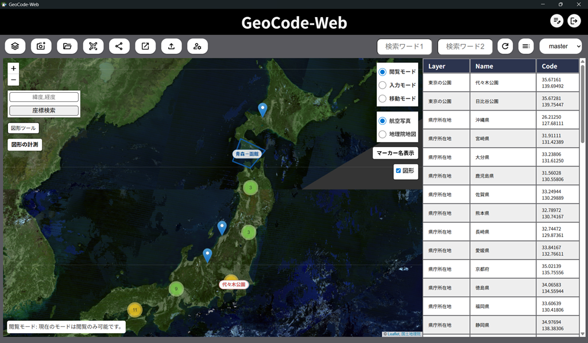

本書は **Windows 上で動作するシングルバイナリ版** を前提に、現在の実装に合わせて操作方法をまとめたものです。

## 2. できること

GeoCode-Web では主に次の作業ができます。

- 地図上にマーカーを追加し、説明文をマークダウンで保存する
- レイヤで情報を分類する
- 画像、PDF、動画をアップロードしてマーカー本文に埋め込む
- 図形を描いて範囲や経路を可視化する
- JSON でデータをインポート、エクスポートする
- 有効期限付きの共有リンクを発行する
- 2 段階認証やプライバシーモードを設定する

具体的な用途では、**現地調査記録、施設管理、案件メモ、顧客訪問履歴、災害対応情報、タウンマップ作成、研究記録** などを想定しており、1 つの地図に情報を整理しやすくなります。

## 3. はじめに知っておきたい用語

| 用語 | 意味 |
| --- | --- |
| マーカー | 地図上に置く地点情報です。 |
| レイヤ | マーカーや図形をまとめるグループです。 |
| `master` レイヤ | 全レイヤを横断して表示する特別なレイヤです。名称変更や削除はできません。 |
| 図形 | ポリゴン、折れ線、矩形のことです。 |
| 共有リンク | 有効期限付きで地図を閲覧してもらうための URL です。 |

## 4. インストール方法

GeoCode-Web シングルバイナリ版は、**Windows 用インストーラ（`.msi`）** を使って導入します。

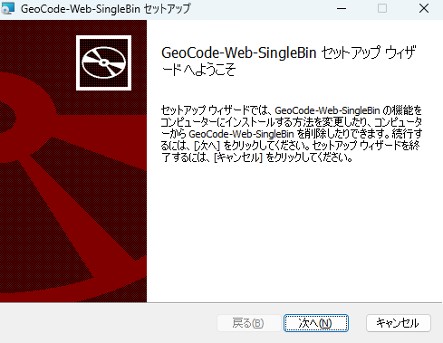

### 4.1 事前確認

インストール前に次を確認してください。

- Windows 環境であること
- 配布された GeoCode-Web のインストーラファイルを入手していること
- インストール先の PC に書き込み権限があること

### 4.2 インストール手順

1. 配布されたインストーラ（`.msi`）をダブルクリックします。
2. インストーラ画面の案内に従って進めます。
3. インストール完了後、スタートメニューまたは作成されたショートカットから起動します。

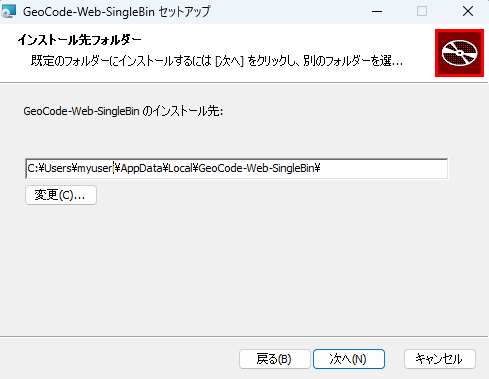

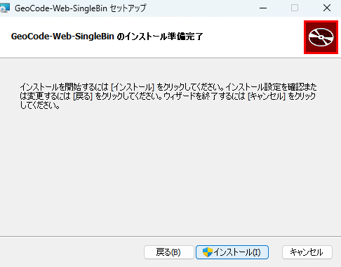

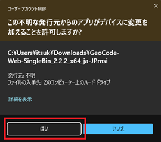

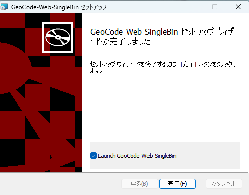

**インストールの警告**

インストール中に次のような警告が出る場合がありますが、このアプリケーションを信頼していただける場合は、「**詳細情報 ⇒ 実行**」の順に進めてください。

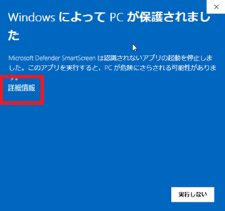 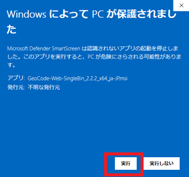 

> この警告は、 GeoCode-Web がまだ若く、広くインストールされていないことや、アプケーション発行元の証明書（通称：EV証明書）を持っていないために起こります。
> 
> EV証明書は一般的に高額であり、より安価な OV証明書と呼ばれるものもありますが、導入については検討中です。

**インストール不要のデモ版**

もし、インストールの前にこのアプリケーションを試したい場合は、[**インストールせずにブラウザで試せるデモ版**](https://demo-geocode-web.pages.dev) を用意しています。

このデモ版では、GeoCode-Web の基本機能を簡単に試すことができます（ブラウザがリセットされるとデータは消えてしまいます）。

まずは、こちらを試していただき、信頼いただけたなら、再度、インストールをお願いします。

### 4.3 インストール後の初回起動

インストール直後の初回起動時には、通常のログイン画面ではなく **初回セットアップ画面** が表示されます。

## 5. 初回起動とセットアップ

### 5.1 初回起動

アプリを初めて起動すると、通常のログイン画面ではなく **初回セットアップ画面** が表示されます。

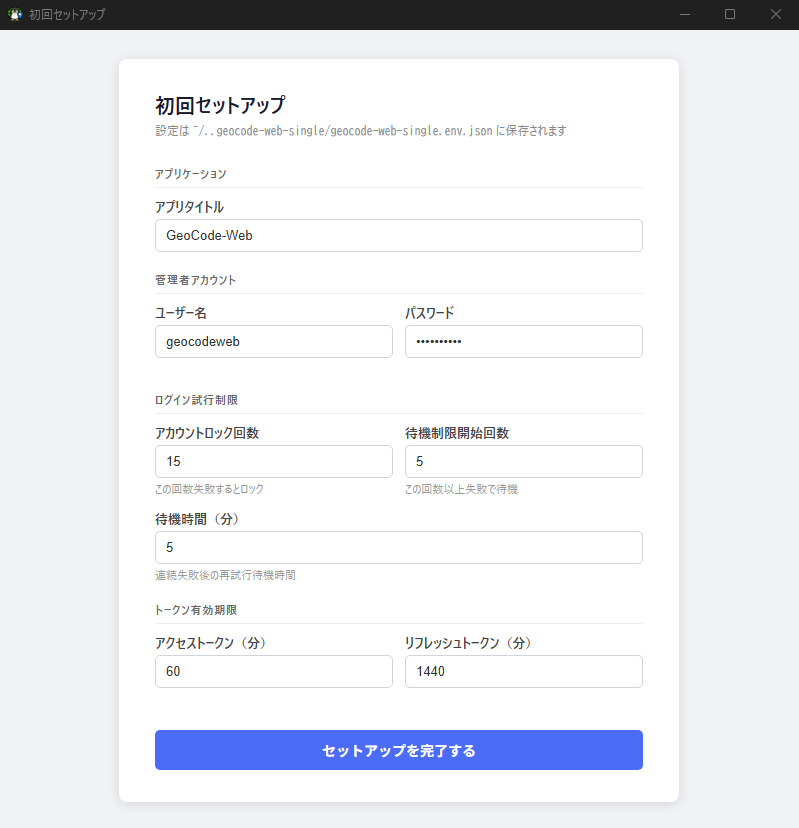

ここでは次の情報を設定します。

- アプリタイトル
- 管理者ユーザー名
- 管理者パスワード
- アカウントロック回数
- 待機制限開始回数
- 待機時間（分）
- アクセストークン有効期限（分）
- リフレッシュトークン有効期限（分）

### 5.2 初期値について

セットアップ画面には例として次の初期値が表示されます。

| 項目 | 初期表示値 |
| --- | --- |
| 管理者ユーザー名 | `geocodeweb` |
| 管理者パスワード | `geocodeweb` |

これは **自動作成済みアカウントではなく、セットアップ時に変更可能な初期入力値** です。運用時は必ず安全な値へ変更してください。

### 5.3 セットアップ完了後に作成されるもの

セットアップが完了すると、ユーザーのホームディレクトリ配下に次のデータが作成されます。

```text
~/.geocode-web-single/
  geocode-web-single.env.json
  geocode-web.sqlite
  images/
```

- `geocode-web-single.env.json`: アプリ設定
- `geocode-web.sqlite`: データベース
- `images/`: アップロードした画像、PDF、動画

## 6. ログイン

セットアップ完了後は、作成したアカウントでログインします。

### 6.1 通常ログイン

ログイン画面では次を入力します。

- Username
- Password

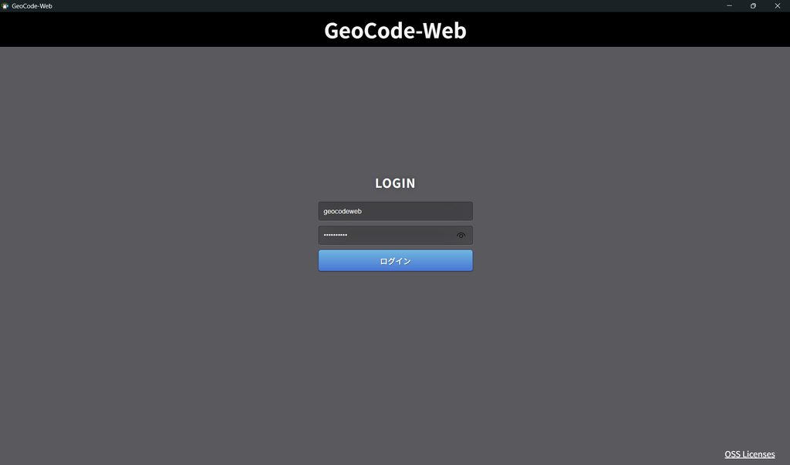

### 6.2 2 段階認証が有効な場合

2 段階認証を有効にしているアカウントは、パスワード認証のあとに **6 桁の認証コード** の入力が求められます。

### 6.3 ログイン失敗時の制御

このアプリには次の制御があります。

- 一定回数以上の失敗で待機時間が発生
- 上限まで失敗するとアカウントがロック
- ロック解除は管理者が実施

## 7. 画面の見方

ログイン後の主画面は、大きく次の 3 つで構成されます。

1. 画面上部のツールバー
2. 左側の地図
3. 右側のマーカー一覧

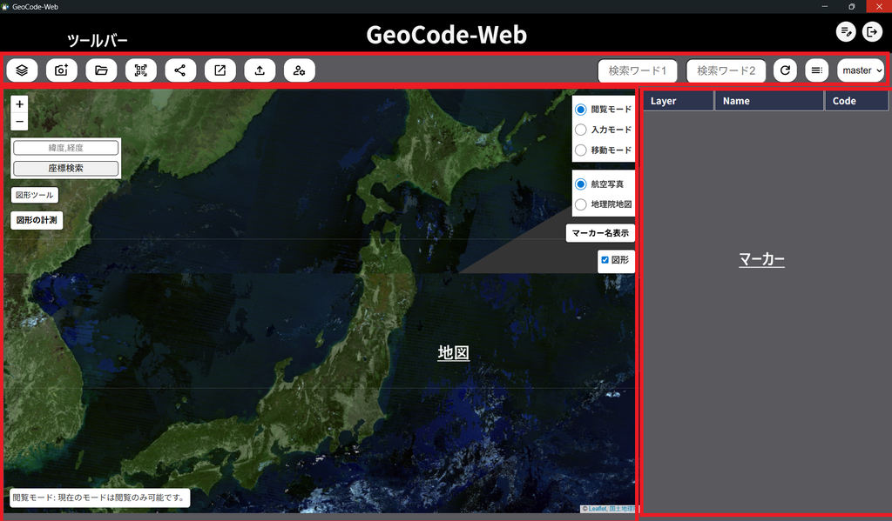

### 7.1 ツールバーでできること

左上から順に次の機能があります。

| 機能 | 内容 |
| --- | --- |
| 新規レイヤ追加 | マーカーを整理するためのレイヤを作成します。 |
| ファイル追加 | 画像、PDF、動画をアップロードします。 |
| ファイル一覧 | アップロード済みファイルの検索、プレビュー、削除を行います。 |
| QR コード生成 | 任意の文字列から QR コード画像を作成します。 |
| 共有リンク作成 | 有効期限付き共有 URL を発行します。 |
| フルスクリーンマップ | 別マップ表示を開きます。 |
| エクスポート | 現在のレイヤを JSON で保存します。 |
| インポート | JSON データを読み込みます。 |
| ユーザー設定 | プライバシーモード、2 段階認証を設定します。 |

右上側では次を操作します。

- 検索ワード 1
- 検索ワード 2
- リロード
- レイヤ一覧
- レイヤ選択

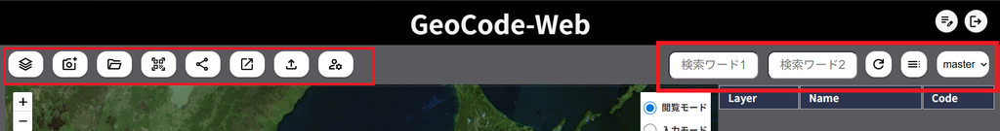

## 8. まずはマーカーを追加する

### 8.1 モードの違い

地図上では 3 つのモードを切り替えて使います。

| モード | 役割 |
| --- | --- |
| 閲覧モード | 地図を見るだけのモードです。 |
| 入力モード | 地図クリックで新しいマーカーを追加するモードです。 |
| 移動モード | 既存マーカーをドラッグして位置修正するモードです。 |

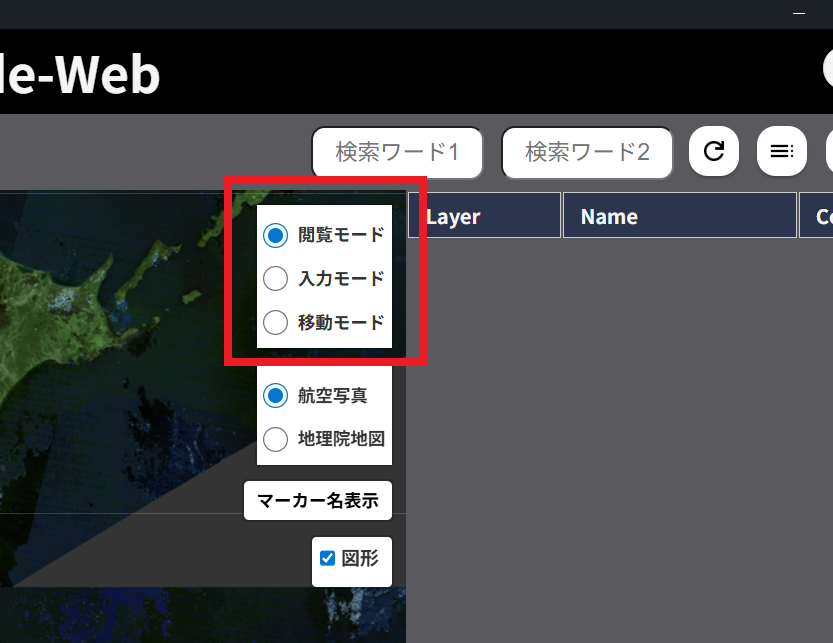

### 8.2 マーカーを作成する

**マーカーの作成**

1. 追加先のレイヤを選択します。
    - 初回起動時には master が選択されているのでそのままで構いません。
2. 地図上で **入力モード** に切り替えます。
3. 地図上の追加したい地点をクリックします。
4. 右側の一覧に新しいマーカーが追加されます。


**マーカー情報の編集画面**

一覧に新たに追加されたマーカーの「Name」列をクリックすることで編集画面が開きます。

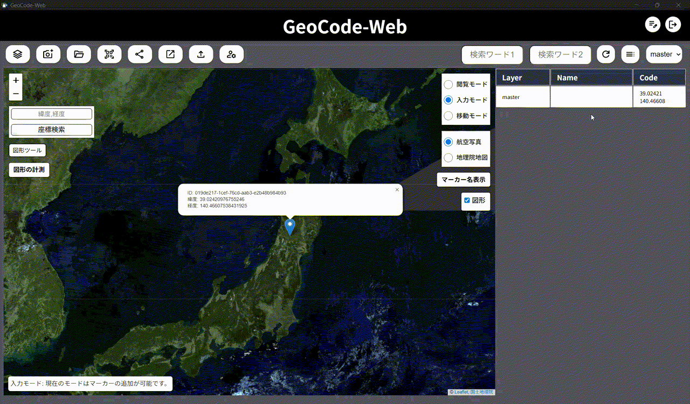


### 8.3 マーカー情報を入力する

編集画面では次を設定できます。

- マーカー名
- 所属レイヤ
- マーカーの内容

マーカーの内容は **Markdown** で入力します。

**マーカー名**

```md
代々木公園
```

**マーカーの内容**

```md
## 概要

- 面積: 54ha
- 所在地: 東京都渋谷区
```

**レイヤ選択**

- `master` のまま

入力後に **`+更新`** を押すと保存されます。

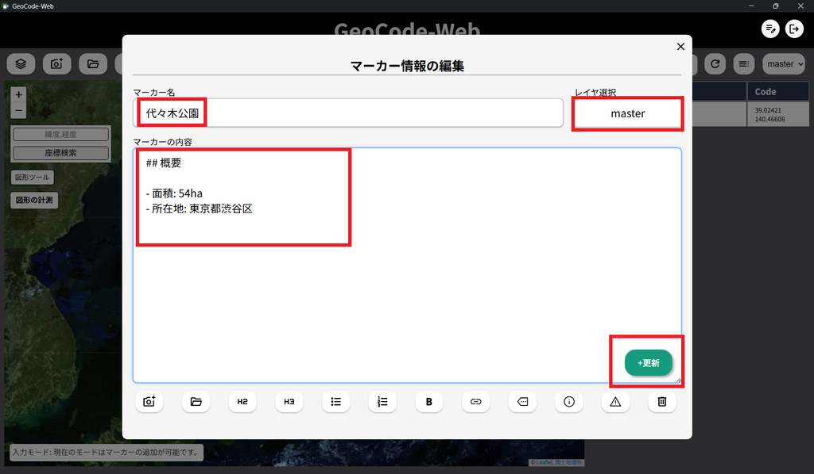

### 8.4 マーカーを移動する

1. 地図上で **移動モード** に切り替えます。
2. 目的のマーカーをドラッグします。
3. ドロップすると位置が保存されます。


### 8.5 マーカーを削除する

マーカー編集画面のゴミ箱ボタンから削除できます。

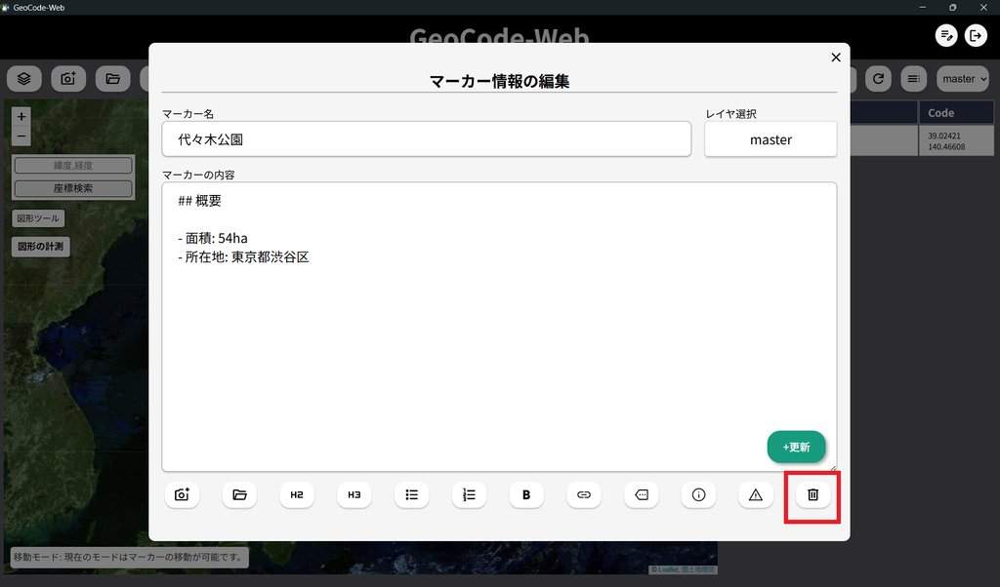


## 9. マーカー本文の書き方

マーカー本文では Markdown が使えます。編集画面には入力補助ボタンもあります。

### 9.1 よく使う記法

```md
## 見出し

### 小見出し

- 箇条書き

1. 番号付きリスト

**太字**

[リンク名](https://example.com)
```

### 9.2 折りたたみや注意書き

次の独自記法も使えます。

```md
:::details 詳細
ここを折りたたんで表示
:::

:::note 補足
補足メモ
:::

:::warning 注意
注意事項
:::
```

### 9.3 画像、PDF、動画の埋め込み

アップロード後に自動生成される Markdown を本文へ貼り付けます。

- 画像: ``
- PDF: `[ファイル名](URL)`
- 動画: `?[ファイル名](URL)`


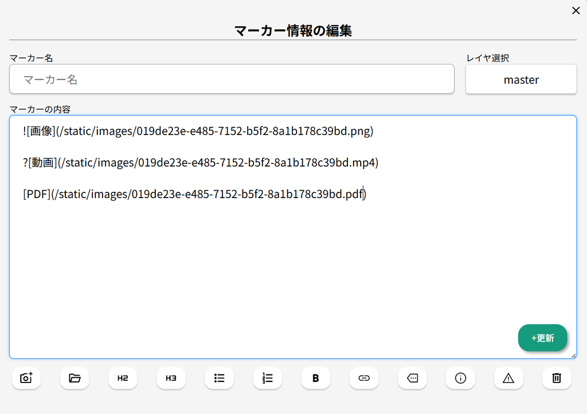

### 9.4 YouTube 埋め込み

YouTube は次の形式で埋め込めます。

```md
@[youtube](https://www.youtube.com/watch?v=XXXXXXXXXXX)
```

## 10. レイヤを使って整理する

### 10.1 レイヤの作成

ツールバーの **新規レイヤ追加** からレイヤを作成します。

例:

- 公園
- 工事計画
- 顧客訪問先


### 10.2 レイヤの切り替え

右上のレイヤ選択から表示対象を切り替えます。

- 個別レイヤ: そのレイヤだけを表示
- `master`: 全レイヤを横断表示


### 10.3 レイヤ一覧

レイヤ一覧では次ができます。

- レイヤ検索
- レイヤ名変更
- レイヤ削除
- レイヤ名クリックによる表示切り替え

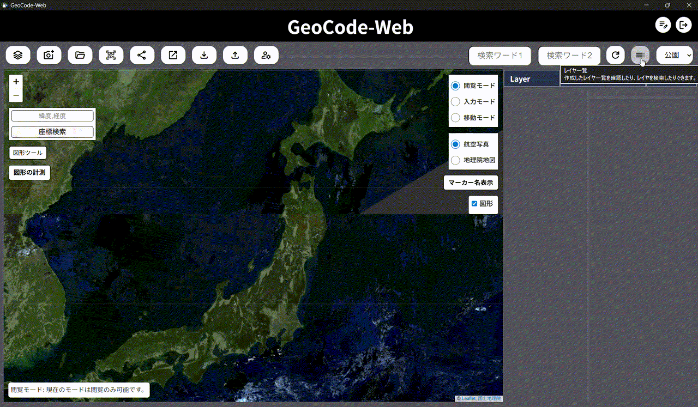

### 10.4 削除時の注意

レイヤを削除すると、そのレイヤに属する **マーカーと図形も削除** されます。

ただし、アップロード済みの画像、PDF、動画ファイル自体は削除されません。

## 11. マーカー検索

検索ボックスは 2 つあります。

- 検索ワード 1
- 検索ワード 2

2 つ入力した場合は **AND 検索** です。

検索対象は次のとおりです。

- マーカー名
- マーカー本文

検索範囲は、現在選択中のレイヤによって変わります。

- 個別レイヤ選択時: そのレイヤ内のみ
- `master` 選択時: 全レイヤ横断


## 12. 座標から場所を探す

地図左上には **座標検索** があります。`緯度,経度` の形式で入力すると、その地点へ移動できます。

例:

```text
35.6895,139.6917
```

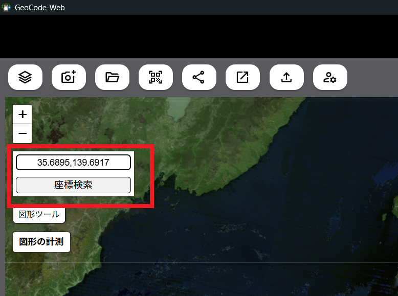

また、右側のマーカー一覧で座標欄をクリックすると、そのマーカーへフォーカスできます。HTTPS または localhost 環境では、その際に座標がクリップボードへコピーされます。


## 13. 図形を描く

GeoCode-Web では、マーカーだけでなく図形も保存できます。

### 13.1 図形ツールでできること

地図上の **図形ツール** から次を選べます。

- ポリゴン
- 折れ線
- 矩形
- 削除
- 削除した図形を戻す
- 完了
- キャンセル


### 13.2 図形作成の流れ

1. 追加先のレイヤを選択します。
2. 図形ツールを開きます。
3. 必要に応じて図形名と色を設定します。
4. 描画モードを選びます。
5. 地図上で点を打ちます。
6. **完了** を押して保存します。

矩形だけは 2 点をクリックすると保存されます。


### 13.3 図形の編集

保存済み図形は次の情報を持ちます。

- 所属レイヤ
- 図形名
- 色

図形名は地図上にラベル表示されます。

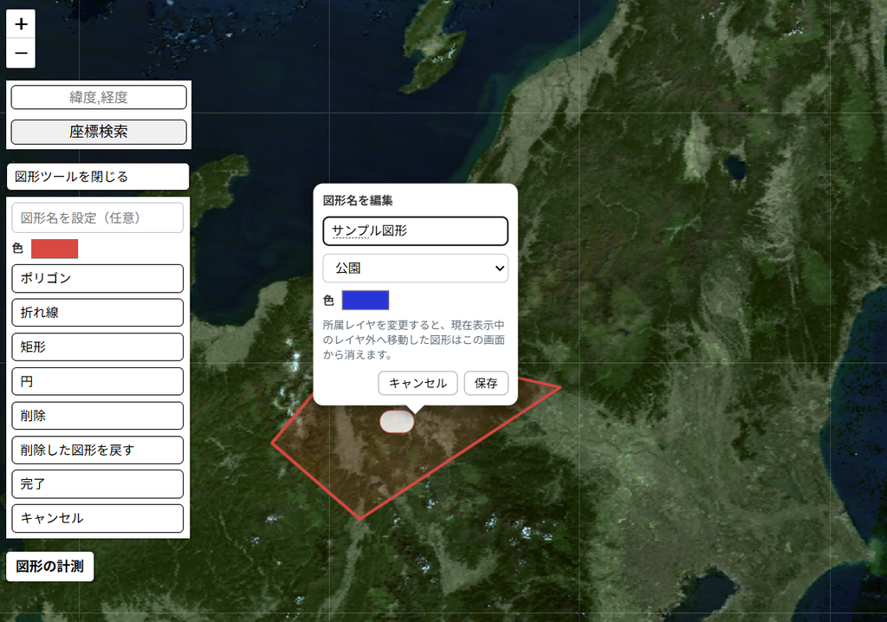

## 14. 画像、PDF、動画を追加する

### 14.1 対応形式

- PNG
- JPG / JPEG
- GIF
- WebP
- PDF
- MP4

1 ファイルの上限は **100MB** です。

### 14.2 アップロード手順

1. ツールバーの **ファイル追加** を開きます。
2. ファイルを選択します。
3. **アップロード** を押します。

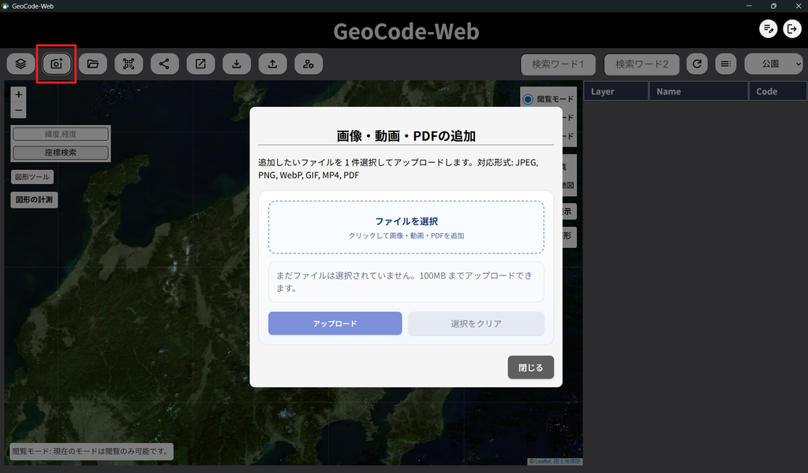

アップロード後は、埋め込み用 Markdown が自動生成されます。

- マーカー編集中なら本文へ自動挿入
- それ以外ではクリップボードへコピー

### 14.3 アップロード後の挙動

- 画像は保存時に最適化され、サムネイルも生成されます。
- 動画は可能な場合 poster 画像が生成されます。
- PDF はリンクとして扱われます。

### 14.4 ファイル一覧

**ファイル一覧** では次の操作が可能です。

- ファイル名検索
- Markdown 文字列のコピー
- プレビュー
- 削除

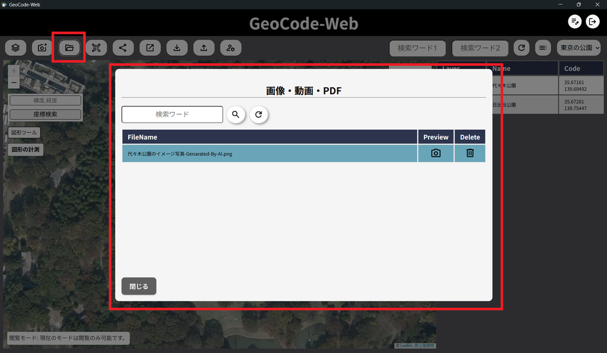

## 15. フルスクリーンマップ

**フルスクリーンマップ** では、別画面の地図を開けます。

通常画面は「現在選択レイヤ」を中心に操作しますが、フルスクリーンマップではレイヤの重ね合わせ確認に向いています。

たとえば次の用途に便利です。

- 複数レイヤを同時に見比べたい
- 地図を大きく表示したい
- 図形とマーカーの重なりを確認したい


## 16. JSON のインポートとエクスポート

### 16.1 エクスポート

エクスポートは **現在選択中の個別レイヤ** を対象に行います。

1. 対象レイヤを選択します。
2. ツールバーの **エクスポート** を押します。
3. JSON ファイルが保存されます。

シングルバイナリ版では、通常 `Downloads` フォルダへ保存されます。取得できない環境では `Documents` に保存されます。

### 16.2 インポート

1. ツールバーの **インポート** を開きます。
2. JSON ファイルを選択します。
3. **アップロード** を押します。

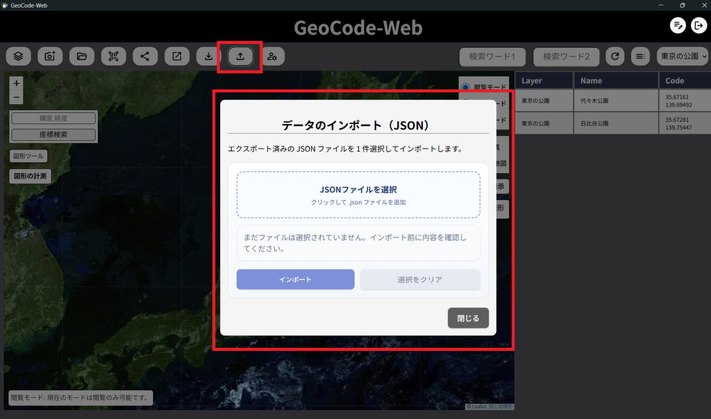

### 16.3 インポート、エクスポートの対象

JSON では次のデータを扱えます。

- レイヤ
- マーカー
- 図形

次のデータは JSON エクスポートに含まれません。

- 画像ファイル本体
- PDF ファイル本体
- 動画ファイル本体

そのため、本文内にファイルを埋め込んでいるデータを他端末へ渡す場合は、ファイル共有方法も別途検討してください。

## 17. 共有リンクを作成する

### 17.1 共有リンクの特徴

共有リンクは **有効期限付きの閲覧用 URL** です。

特徴:

- 複数レイヤを選択して共有できる
- 有効期限を分単位で設定できる
- 共有パスワードを設定できる
- 図形を共有対象に含められる
- 既存リンクの内容更新もできる

### 17.2 作成手順

1. ツールバーの **共有リンク作成** を開きます。
2. 有効期限を入力します。
3. 必要に応じて共有パスワードを設定します。
4. 必要に応じて **図形も共有する** を ON にします。
5. 共有するレイヤにチェックを入れます。
6. 共有リンクを新規発行、または更新します。

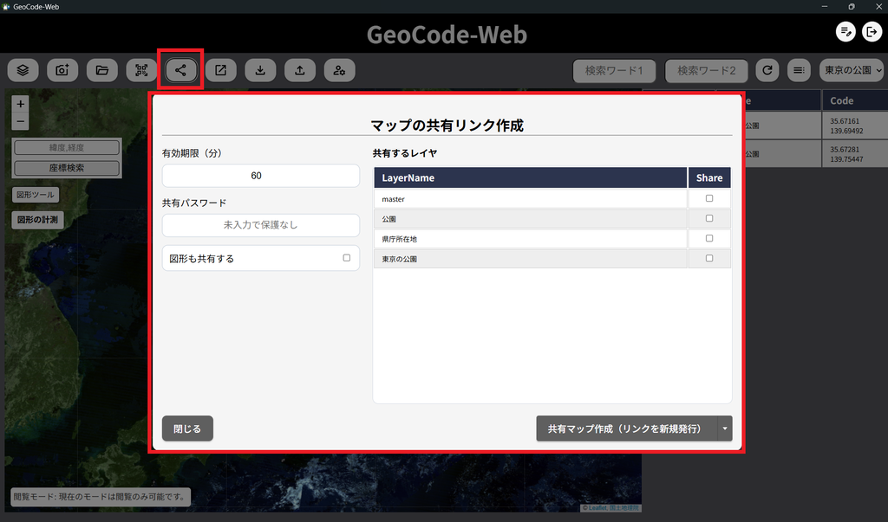

### 17.3 共有時の重要な注意

共有ページは **作成時点のスナップショット** を保持します。元データを後で編集しても、共有ページへ自動反映はされません。反映したい場合は **リンクを更新** してください。

### 17.4 画像が見えない場合

他ユーザーや共有リンクから画像を閲覧させたい場合は、所有者の **プライバシーモードを OFF** にしてください。プライバシーモードが ON の場合、他者はその画像にアクセスできません。

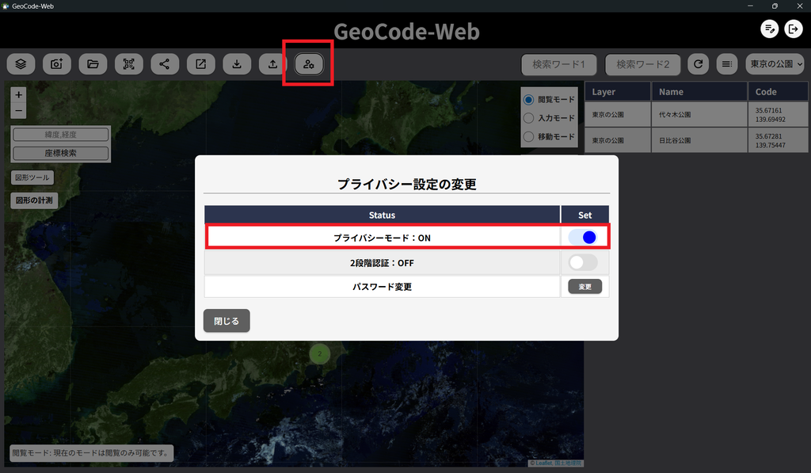

## 18. QR コードを生成する

QR コード生成機能では、任意の文字列から PNG 画像を作成できます。

1. ツールバーの **QR コード生成** を開きます。
2. 文字列を入力します。
3. QR コードが表示されたら **保存** を押します。

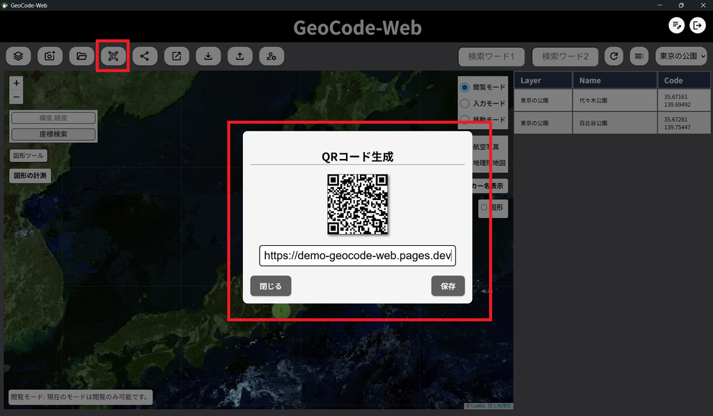

作成した PNG は通常のファイルとして GeoCode-Web にアップロードできます。

## 19. ユーザー設定

### 19.1 プライバシーモード

プライバシーモードを ON にすると、他ユーザーから自分の画像などへアクセスできなくなります。

- ON: 外部共有を制限
- OFF: 共有リンクや他ユーザーへのファイル共有が可能

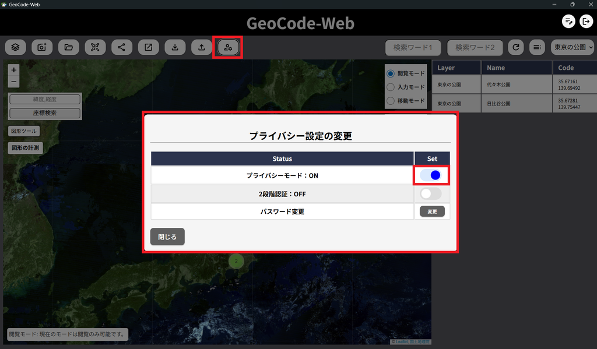

### 19.2 2 段階認証

ユーザー設定から 2 段階認証を有効化できます。

手順:

1. QR コードを Google Authenticator などで読み取る
2. 6 桁コードを入力する
3. 認証に成功すると有効化完了

無効化も同じ画面から行えます。

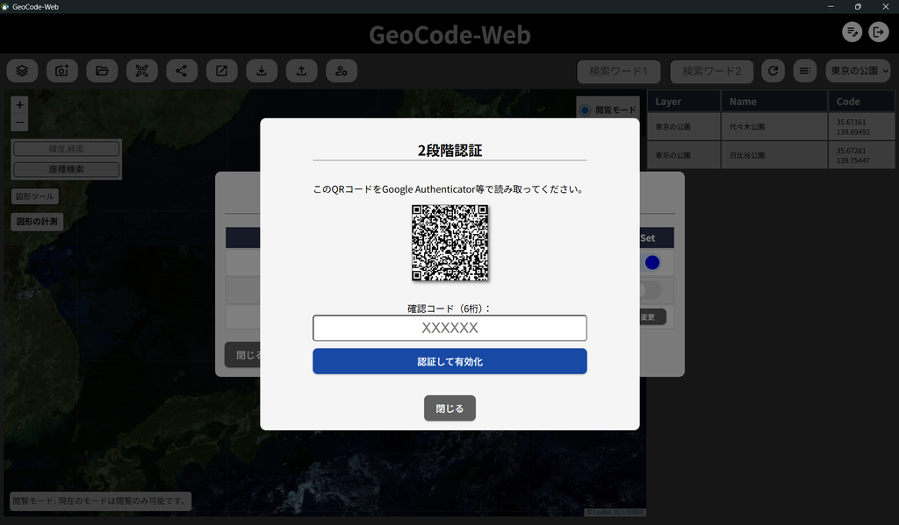

## 20. キーボードショートカット

主なショートカットは次のとおりです。

| キー | 動作 |
| --- | --- |
| `Ctrl + 1` | 新規レイヤ追加 |
| `Ctrl + 2` | ファイル追加 |
| `Ctrl + 3` | ファイル一覧 |
| `Ctrl + 4` | QR コード生成 |
| `Ctrl + 5` | 共有リンク作成 |
| `Ctrl + 6` | フルスクリーンマップ |
| `Ctrl + M` | マーカー編集画面で更新 |
| `Alt + 1` | 検索ワード 1 にフォーカス |
| `Alt + 2` | 検索ワード 2 にフォーカス |
| `Alt + 3` | マーカー検索をリセット |
| `Alt + 4` | レイヤ一覧を開く |
| `Alt + 5` | レイヤ選択へフォーカス |
| `Esc` | メッセージを閉じる |

## 21. 管理者向け補足

管理者は別の管理画面（ブラウザで起動）で次の作業ができます。

- 一般ユーザー作成
- ユーザーのパスワード再設定
- ロックされたアカウントの解除

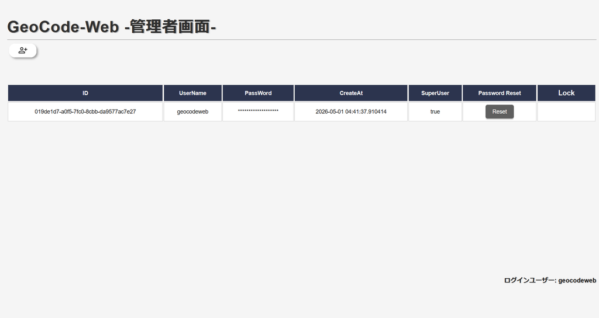

一般ユーザーの自己登録は、設定によって無効になっている場合があります。ログイン画面に「アカウントを作成しますか？」のリンクが表示されない場合は、管理者にアカウント作成を依頼してください。

URL は `スキーム://ドメイン/admin` です。

## 22. タイルサーバについて

GeoCode-Web では、地図表示に使用する **タイルサーバ** を切り替えて利用できます。

### 22.1 標準状態で利用できる地図

標準インストール直後の状態では、次の国土地理院タイルが利用できます。

- 地理院地図
- 航空写真

すでに登録されているタイルは、地図画面上のタイル切り替え UI から選択して表示を切り替えます。

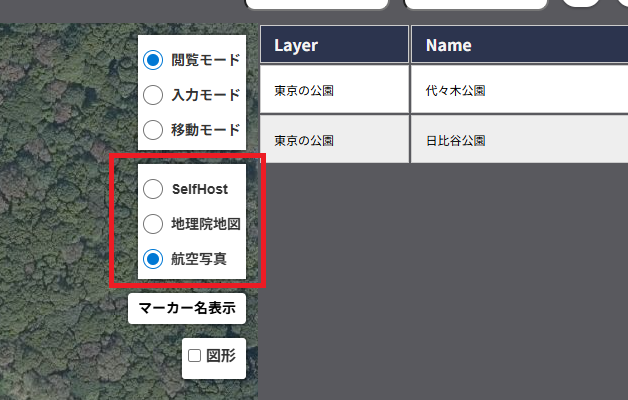

### 22.2 OSM について

OpenStreetMap 自体は無償で利用できるデータですが、**公開タイルサーバをアプリに組み込んだ状態で前提利用させる形** は、本アプリの標準配布には含めていません。

そのため、GeoCode-Web シングルバイナリ版では **OSM の公開タイルサーバを標準搭載していません**。

### 22.3 カスタムタイルサーバの利用

次のようなケースであれば、GeoCode-Web で別の地図を利用することは可能です。

- 自前で OSM タイルサーバを構築して利用する場合
- 組織内で契約、運用している別タイルサーバを利用する場合
- 個別に要件整理したうえで、別の地図配信基盤を組み込んで利用する場合

**Open Street Map を使用した例**

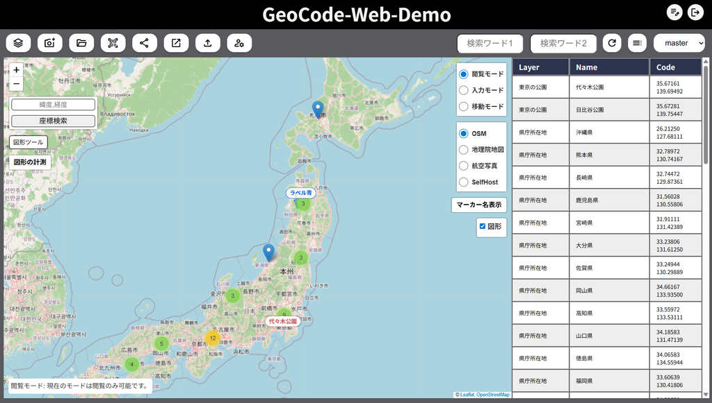

### 22.4 現在の追加方法について

現行バージョンでは、タイルサーバの追加は、システム管理者向け **アプリ画面から行う方式ではなく、SQL で登録する方式のみ** を残しています。

このため、本ユーザーガイドでは日常利用に必要な操作を中心に扱い、SQL による登録手順そのものは記載していません。

### 22.5 個別導入、サポートについて

カスタムタイルサーバの追加は、次のような観点で個別調整が必要になることがあります。

- 利用規約や配布条件の確認
- タイル URL や attribution の整理
- 組織内ネットワークでの接続確認
- 海外タイルを含む表示範囲の調整
- 運用保守方法の整理

そのため、**追加タイルサーバの組み込みや設定支援は、個別対応向けのサポート対象** としてご案内いたします。導入を検討している場合は、開発・配布元である [marudev-contact@marudev.org](mailto:marudev-contact@marudev.org) へ相談してください。

## 23. バックアップのおすすめ

GeoCode-Web の重要データは、基本的に次の 3 つです。

- `~/.geocode-web-single/geocode-web.sqlite`
- `~/.geocode-web-single/images/`
- `~/.geocode-web-single/geocode-web-single.env.json`

定期バックアップを推奨します。特にレイヤ削除や大量インポート前には、これらを丸ごと退避しておくと安心です。

## 24. よくある注意点

- `master` レイヤは全体表示用です。名前変更、削除はできません。
- エクスポートできるのは JSON データであり、ファイル本体は含まれません。
- レイヤ削除時は、そのレイヤのマーカーと図形も消えます。
- 画像共有が必要な場合はプライバシーモードを確認してください。
- 共有リンクはライブ同期ではなく、作成時点のスナップショットです。
- タイルサーバの追加は標準 UI では行えず、現行では SQL 登録が前提です。

## 25. おすすめの使い方

最初は次の流れで使うとスムーズです。

1. レイヤを作る
2. マーカーを追加する
3. Markdown で説明を書く
4. 必要なら画像や PDF を添付する
5. 図形で範囲や経路を描く
6. JSON でバックアップする
7. 必要なときだけ共有リンクを発行する

この流れに慣れると、現地調査記録、施設管理、案件メモ、顧客訪問履歴、災害対応情報などを 1 つの地図に整理しやすくなります。
